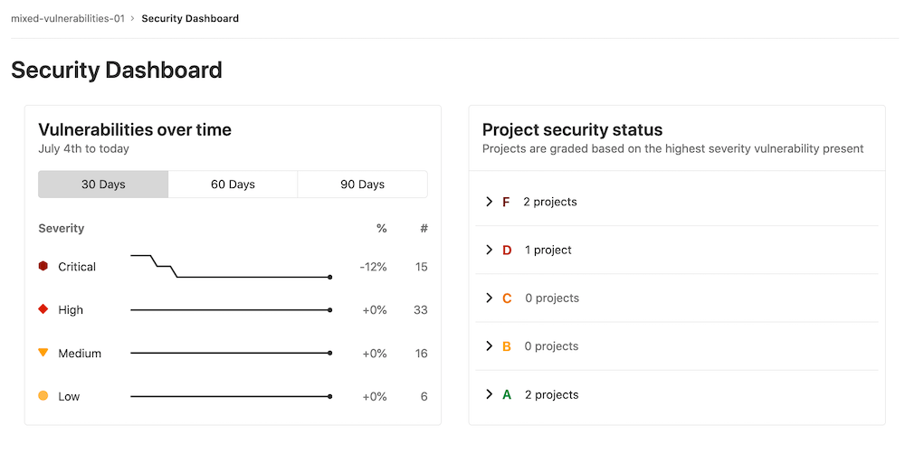

# Contrast-Gitlabs-Integration

A sample script that I wrote in early 2021 which integrates into Gitlab's Security Dashboard so that a specific IAST vendor, Contrast Security, feed its results into the dashboard. An example of what that dashboard would look like after being populated can be found below:

--

--

