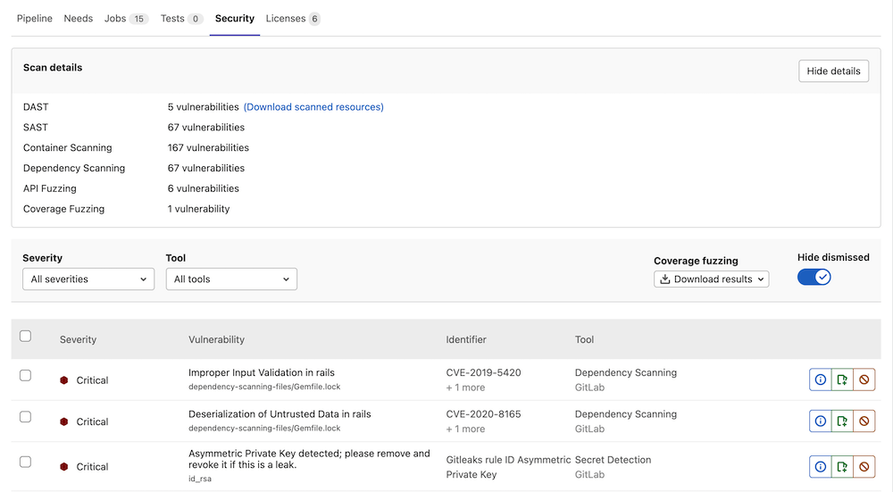
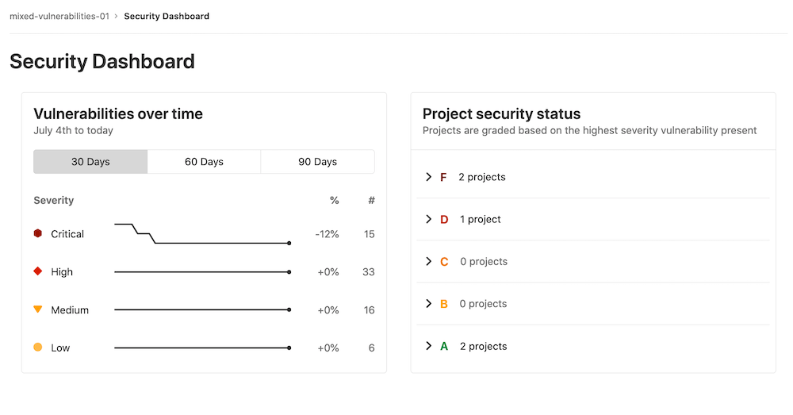

# Example gitlab-ci.yml files

Example configurations for Gitlab](https://about.gitlab.com/)'s [Security Dashboard](https://about.gitlab.com/handbook/engineering/security/security-engineering-and-research/application-security/runbooks/security-dashboard-review.html) showing various customizations.

## Security Dashboard Examples

--

--

## gitlab-ci.yml's

### [Example 1](example1_gitlab-ci.yml)

* Standard include of [DAST.gitlab-ci.yml](https://docs.gitlab.com/ee/user/application_security/dast/) which includes the bulk of the configuration infrastructure.
* Under dast_configuration section, both the site profile and the scanner profile are referenced via profiles that are stored within Gitlab so as not to store their sensitive information the code repository itself. This also allows for the updating of various parameters without needing to touch the overall logic of the DAST scan.
* [DAST _AUTH _REPORT](https://docs.gitlab.com/ee/user/application_security/dast/) is added to allow for the graphical authentication via web browser to the target site to always be auditable. If something goes wrong, the cause will be auditable via the dash job. Additionally, we have referenced `gl-dast-debug-auth-report.html` in the `artifacts/paths` section in order to explicitly include that auth report in the job data.
* There are multiple means by which a authentication dialog can be identified within a webpage, that the authentication can occur, and that the authentication's outcome can be identified. This profile performs form-based verification *by default (not explicitly specified* and then verifies that the authentication completed successfully using `DAST_AUTH_VERIFICATION_SELECTOR: "id:frmWelcome"` and expecting an object with that id to be specified in the resulting page.

### [Example 2](example2_gitlab-ci.yml)

* Standard include of [DAST.gitlab-ci.yml](https://docs.gitlab.com/ee/user/application_security/dast/) which includes the bulk of the configuration infrastructure.
* Under dast_configuration section, both the site profile and the scanner profile are referenced via profiles that are stored within Gitlab so as not to store their sensitive information the code repository itself. This also allows for the updating of various parameters without needing to touch the overall logic of the DAST scan.
* [DAST _AUTH _REPORT](https://docs.gitlab.com/ee/user/application_security/dast/) is added to allow for the graphical authentication via web browser to the target site to always be auditable. If something goes wrong, the cause will be auditable via the dash job. Additionally, we have referenced `gl-dast-debug-auth-report.html` in the `artifacts/paths` section in order to explicitly include that auth report in the job data.
* There are multiple means by which a authentication dialog can be identified within a webpage, that the authentication can occur, and that the authentication's outcome can be identified. This profile identifies an authentication form by looking for a submit button as specified by `DAST_SUBMIT_FIELD: "css:button[class=internalLogin__loginAction]"` and then verifies that the authentication completed successfully using `DAST_AUTH_VERIFICATION_SELECTOR: "css:.header-navigation__logout` and expecting an object with that css tab to be specified in the resulting page.
* The gitlab DAST engine employs the [OWASP Zap](https://owasp.org/www-project-zap/) tool underneath and by default curates a specific list of rules to be run or excluded based on their experience with value provided versus false positive rates and perceived noise. Those zap rules can be excluded explicitly by specifying a comma-separated list of rule ID's as so: `DAST_EXCLUDE_RULES: "20012"`. Unfortunately, I found the list of ID's difficult to find and at the time of authoring this document, I do not have that URL.